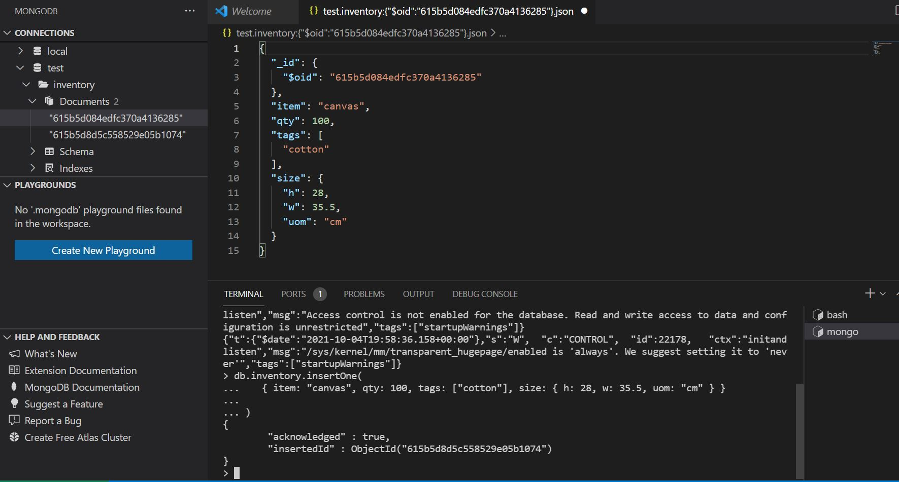
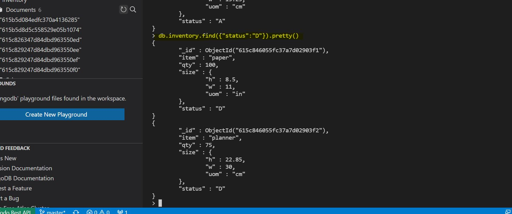
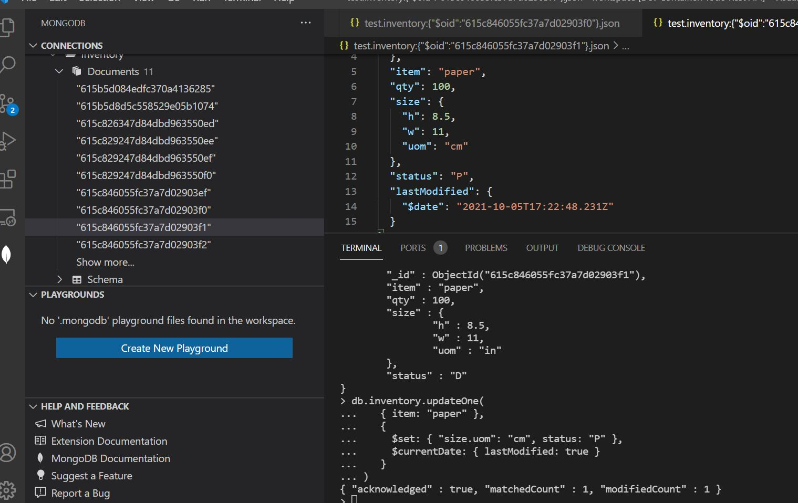
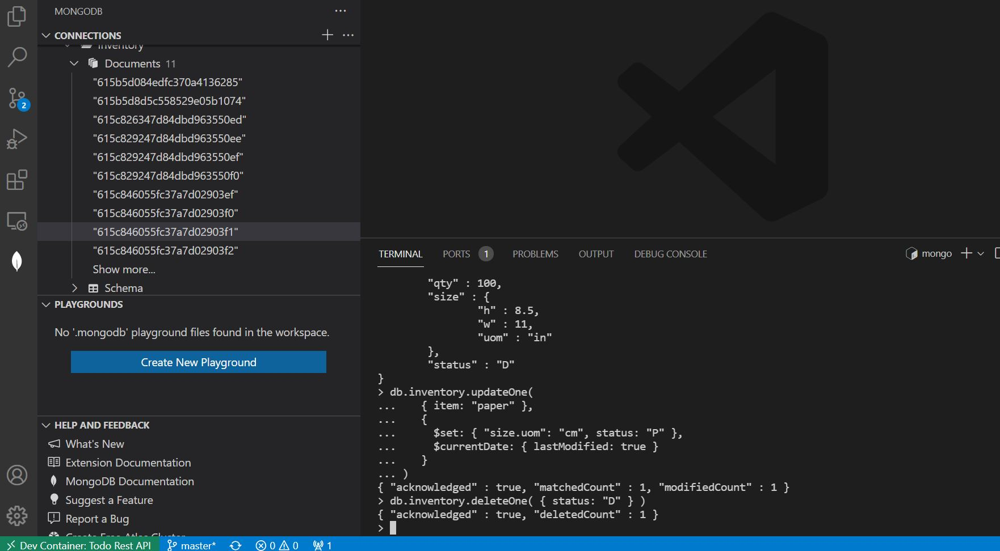
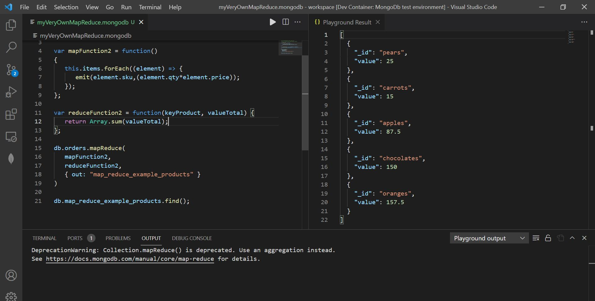

# DAT250: Software Technology Experiment Assignment 3

## Code

Code is [here](https://github.com/andlekbra/dat250-expass3-mongodb)

## Installation

- To be able to work with my code on different computers without installing all dependendcies, I chose to use the official mongodb docker container from [docker hub](https://hub.docker.com/_/mongo).
- I also ran my development environment in a vs code devcontainer with mongodb shell installed. The docker files are available in the repo for further details.
- Since the links are pointing to a tutorial for version 5.0. To avoid inconsistencies I used the latest image of mongodb and not version 4.4 as specified in the assignment.

## Problems
- I had some initial problems with defining the devcontainer and dockerfiles. When the docker files were correct, the development experience was very smooth even when using different computers. I used VS Code and Docker desktop on both.

## Experiment 1

### Insert

### Find

### Update

### Delete

## Experiment 2

The map reduce code and results can be seen in the repository.
- My map reduce sums the income for each product type, which is useful if you want to see what product generates the highest revenue.
- The result is an json array of key value pairs, with the product name as key and income for the product as value.
- Comment to the assignment. MapReduce is deprecated in monogodb. I would prefer that Aggregation pipeline was the mandatory part of the assignment

